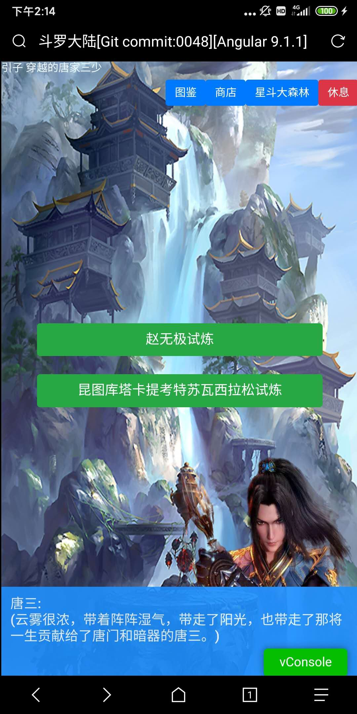

# 极简游戏攻略

除了剧情对话之外，本游戏暂时只有一个分叉选择

- 【赵无极试炼】是正确的分支，可以通往史莱克的正常剧情，这个分支的话，史莱克七怪将挑战赵无极老师等人
- 【昆图库塔卡提考特苏瓦西拉松试炼】是番外篇的分支，可以进入番外分支

如果你选择了【赵无极试炼】分支，则战斗会非常幸苦。如果你选择了【昆图库塔卡提考特苏瓦西拉松试炼】分支，则你会发现敌我由于等级属性一致，无法分出胜负。

- 提示1.星斗大森林的二层宝箱有一个道具：佛怒唐莲，群体伤害99999（核弹级别杀伤力啊）
- 提示2.你的背包里面有一个道具：观音泪，群体伤害99，屠龙（LV1）是没有问题的。
- 提示99.地图去过的地方，可以瞬移的
