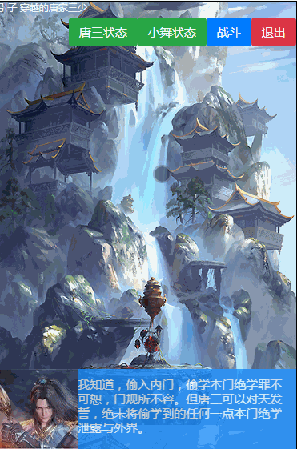
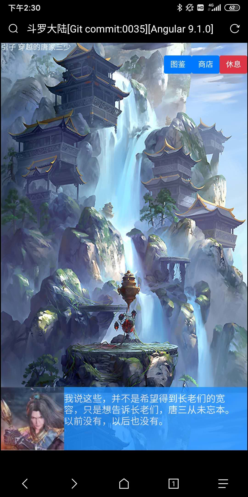
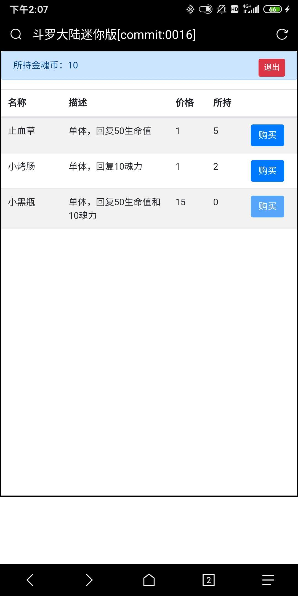
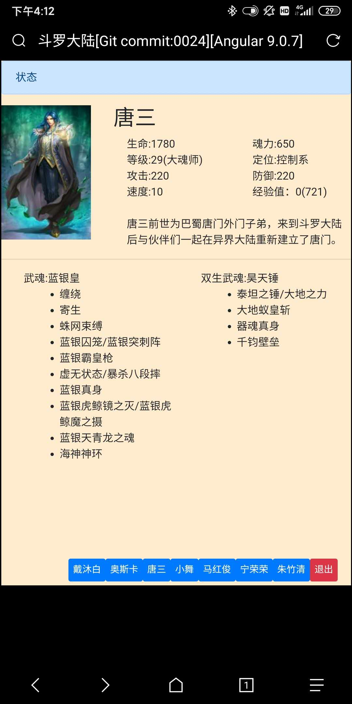
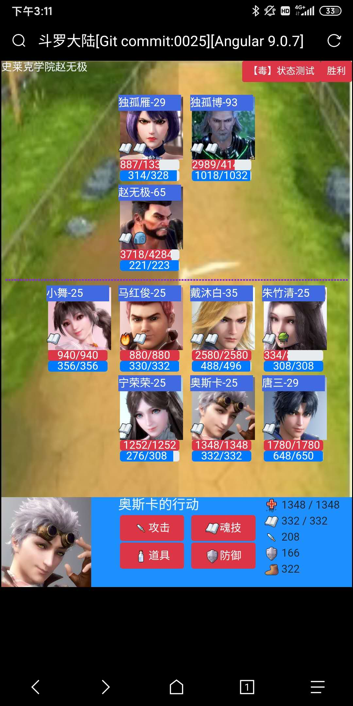
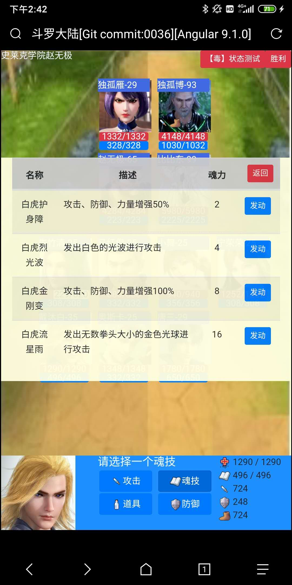
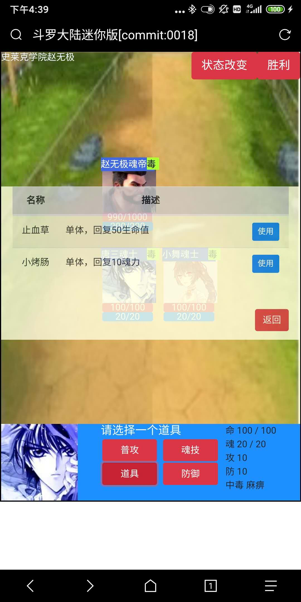
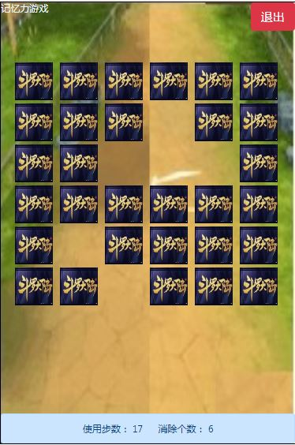
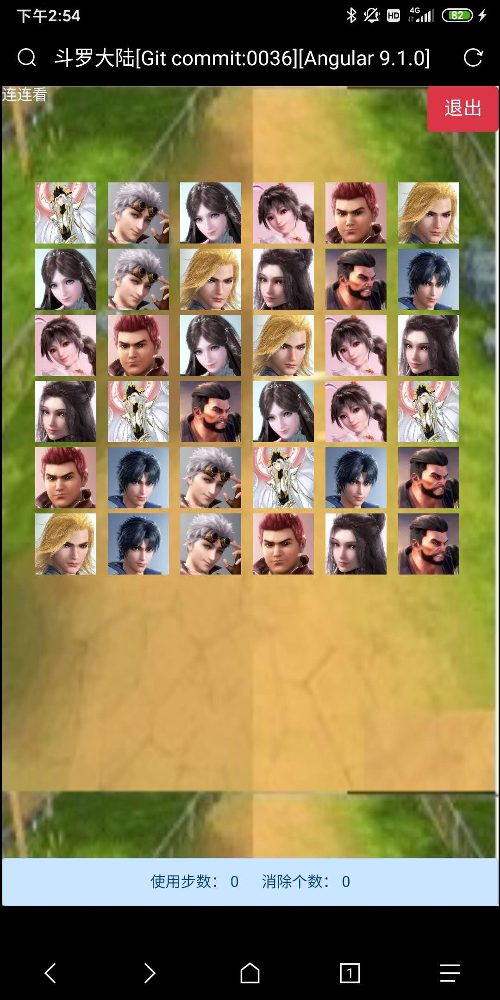

# 斗罗大陆 Angular9版本

该项目没有斗罗大陆版权，所有的图像，文本，只是作为教学示例！！！

该项目没有斗罗大陆版权，所有的图像，文本，只是作为教学示例！！！

该项目没有斗罗大陆版权，所有的图像，文本，只是作为教学示例！！！

## 开发环境

- Angular 9.0.7
- BootStrap 4.4.1

## 在线网址

http://datavisualization.club:8888/

## Demo画面

### 效果

### 场景

### 场景

### 状态[双生武魂]

### 战斗

### 魂技选择

### 道具选择

### 记忆力游戏

### 连连看

