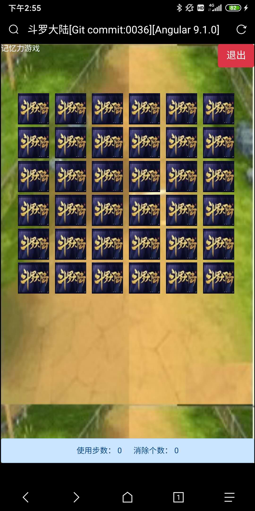

# 斗罗大陆 Angular9版本

该项目没有斗罗大陆版权，所有的图像，文本，只是作为教学示例！！！

该项目没有斗罗大陆版权，所有的图像，文本，只是作为教学示例！！！

该项目没有斗罗大陆版权，所有的图像，文本，只是作为教学示例！！！

## Angular9教程 面向对象的RPG游戏开发

通过对于斗罗大陆小说的游戏化过程，熟悉Angular的结构以及使用TypeScript的面向对象开发方法。

[教程链接](Tutorial/README.md)

## 开发环境

- Angular 9.1.1
- BootStrap 4.4.1
- Issue：[BugClose](https://www.bugclose.com/)
- IDE：VS Code 1.4.4
- OS：Windows7
- Server：CentOS
- 在线AI抠图工具[皮卡智能](http://www.picup.shop/people.html#/)

## 兼容性

- Windows7 Chrome最新版
- Android iOS

## 目标功能

### 基本

- 登陆
- 场景转移/分支剧情选择
- 图鉴和状态
- 战斗
- 魂环，魂骨，魂技串联

### 道具

- 普通道具（回复类、攻击类）
- 商店

### 魂技

- 魂环/魂骨
- 融合技

### 场景

- 星斗大森林
- 连连看
- 记忆力游戏

## 在线体验网址（推荐使用移动设备访问）

http://datavisualization.club:8888/

## 极简游戏攻略

除了剧情对话之外，本游戏暂时只有一个分叉选择

- 【赵无极试炼】是正确的分支，可以通往史莱克的正常剧情，这个分支的话，史莱克七怪将挑战赵无极老师等人
- 【昆图库塔卡提考特苏瓦西拉松试炼】是番外篇的分支，可以进入番外分支

如果你选择了【赵无极试炼】分支，则战斗会非常幸苦。如果你选择了【昆图库塔卡提考特苏瓦西拉松试炼】分支，则你会发现敌我由于等级属性一致，无法分出胜负。

- 提示1.星斗大森林的二层宝箱有一个道具：佛怒唐莲，群体伤害99999（核弹级别杀伤力啊）
- 提示2.你的背包里面有一个道具：观音泪，群体伤害99，屠龙（LV1）是没有问题的。
- 提示99.地图去过的地方，可以瞬移的

## Demo画面

### 效果

### 场景

### 场景分支

### 星斗大森林

### 商店

### 图鉴

### 双生武魂

### 战斗

50%以下血量在白色部分显示血槽进度

敌方行动的Toast表示

### 魂技选择

### 道具选择

### 记忆力游戏

### 连连看

### vconsole

## 人物列表

### 史莱克七怪

- 唐三：高
- 小舞：高
- 戴沐白：高
- 奥斯卡：低
- 马红俊：低
- 宁荣荣：高
- 朱竹清：高

### 史莱克学院

- 弗兰克：低
- 柳二龙：低
- 玉小刚：低
- 赵无极：中
- 独孤博：中
  
### 武魂殿

- 比比东：低

### 其他

- 独孤雁
- 叶泠泠
