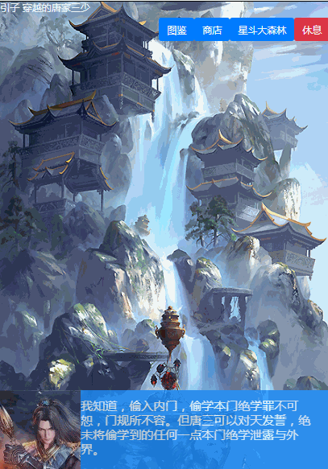
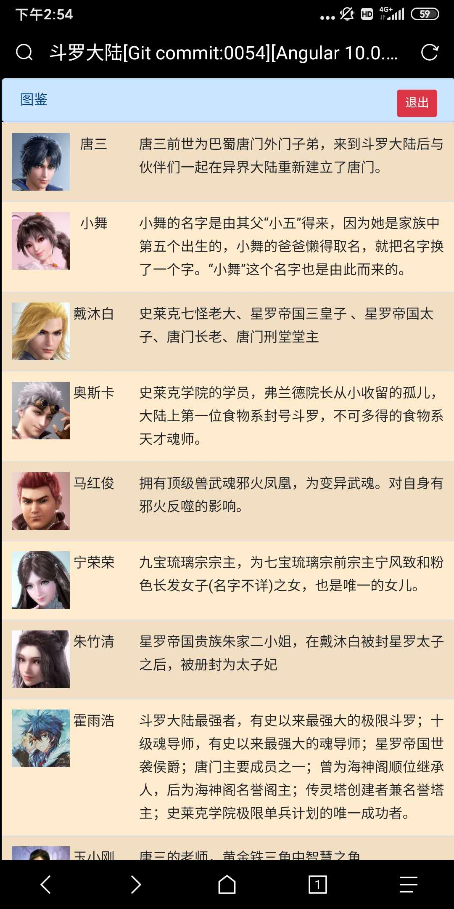
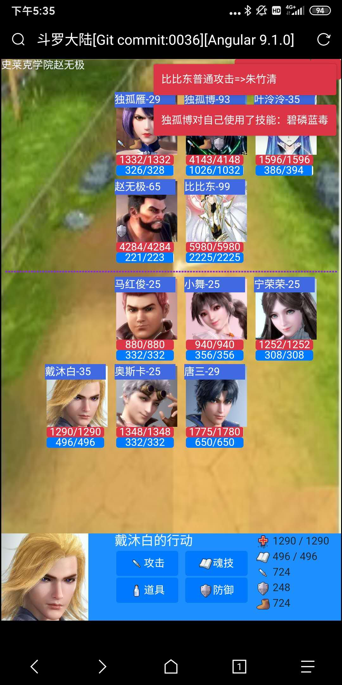

# 斗罗大陆 Angular9版本

该项目没有斗罗大陆版权，所有的图像，文本，只是作为教学示例！！！

该项目没有斗罗大陆版权，所有的图像，文本，只是作为教学示例！！！

该项目没有斗罗大陆版权，所有的图像，文本，只是作为教学示例！！！

## Angular9教程 面向对象的RPG游戏开发

通过对于斗罗大陆小说的游戏化过程，熟悉Angular的结构以及使用TypeScript的面向对象开发方法。

[教程链接](Tutorial/README.md)

## 开发环境

- Angular 9.1.1
- BootStrap 4.4.1
- Issue：https://www.bugclose.com/
- IDE：VS Code

## 兼容性

- Windows7 Chrome最新版
- Android iOS

## 目标功能

### 基本

- 登陆
- 场景转移/分支剧情选择
- 图鉴和状态
- 战斗
- 魂环，魂骨，魂技串联

### 道具

- 普通道具（回复类、攻击类）
- 商店

### 魂技

- 魂环/魂骨
- 融合技

### 开发中

- 星斗大森林

## 在线网址

http://datavisualization.club:8888/

## Demo画面

### 效果

### 场景

### 星斗大森林

### 商店

### 图鉴

### 双生武魂

### 战斗

50%以下血量在白色部分显示血槽进度

敌方行动的Toast表示

### 魂技选择

### 道具选择

### 记忆力游戏

### 连连看

